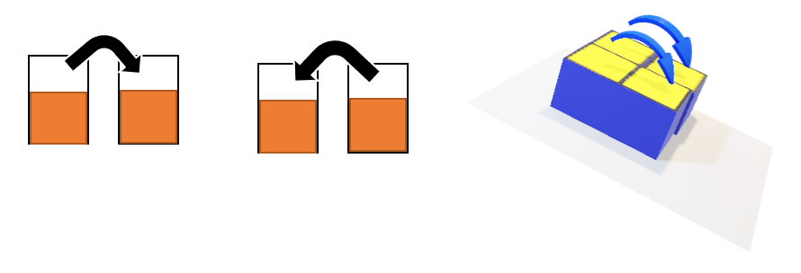

# CASI D’USO

## Titolo: Apertura dell’applicazione
Attori Principali: Utente
Prerequisiti: Installazione dell’applicazione su tablet/smartphone
Racconto: 
1.	L’utente clicca sull’icona dell’applicazione ponendo lo smartphone in posizione orizzontale
2.	Il sistema apre l’applicazione
3.	Il sistema visualizza l’interfaccia di gioco: una matrice di vasche contenenti inizialmente quantità di sabbia uguale e alcune palline presenti in scatole casuali

## Titolo: Inclinazione del tablet/smartphone su un asse
Attori Principali: Utente
Prerequisiti: Installazione dell’applicazione su tablet/smartphone, apertura dell’applicazione
Racconto: 
1.	L’utente inclina il tablet/smartphone rispetto a un asse
2.	Il sistema calcola gli spostamenti della sabbia e della pallina in base alla direzione e al verso dell’inclinazione del dispositivo
3.	Il sistema visualizza graficamente lo spostamento della sabbia e della pallina tra le vasche

## Titolo: Inclinazione del tablet/smartphone su più assi
Attori Principali: Utente
Prerequisiti: Installazione dell’applicazione su tablet/smartphone, apertura dell’applicazione
Racconto: 
1.	L’utente inclina il tablet/smartphone rispetto ai due asse
2.	Il sistema calcola gli spostamenti della sabbia e delle palline per ogni asse, come nel caso d’uso precedente
3.	Il sistema somma i risultati del punto 2 per calcolare gli spostamenti finali della sabbia e delle palline
4.	Il sistema visualizza graficamente lo spostamento della sabbia e della pallina tra le vasche

## Titolo: Movimento del tablet/smartphone sull’asse verticale
Attori Principali: Utente
Prerequisiti: Installazione dell’applicazione su tablet/smartphone, apertura dell’applicazione
Racconto: 
1.	L’utente muove in modo brusco il tablet/smartphone rispetto all’asse verticale
2.	Il sistema calcola gli spostamenti della sabbia e delle palline per ogni asse, come nel caso d’uso precedente
3.	Il sistema calcola la velocità del salto della pallina in base al movimento del dispositivo
4.	Il sistema aggiorna la grafica visualizzando la pallina che salta

## Titolo: Chiusura dell’applicazione
Attori Principali: Utente
Prerequisiti: Installazione dell’applicazione su tablet/smartphone, apertura dell’applicazione
Racconto: 
1.	L’utente clicca sul pulsante “Indietro”
2.	Il sistema chiede una conferma per la chiusura dell’applicazione
3.	L’utente clicca “Sì” e conferma la chiusura
4.	Il sistema chiude l’applicazione.
